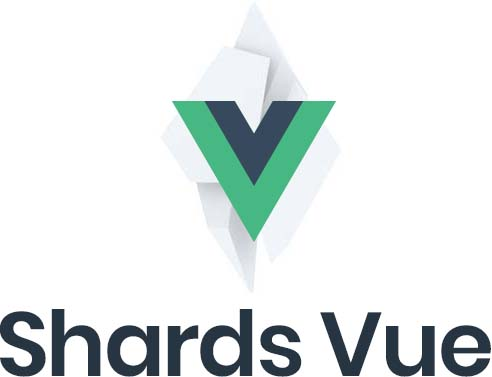

<p align="center">

</p>

<p align="center">
Shards Vue is a free, beautiful and modern Vue.js UI kit <br /> based on <a href="https://github.com/designrevision/shards-ui">Shards</a>.
</p>

<br />

<p align="center">
  <a href="#">
    
  </a>
  <a href="https://twitter.com/designrevision">
    
  </a>
</p>

<br />

<p align="center">
  <a href="https://designrevision.com/docs/shards-vue/"><strong>Documentation & Demo</strong></a> •
  <a href="https://designrevision.com/downloads/shards-vue/"><strong>Official Page</strong></a>
</p>


### Getting Started

Getting started with Shards Vue is fairly simple. You can download Shards Vue via the official website, here on GitHub as a release package or by using a package manager such as Yarn or NPM.

* [Official Website](https://designrevision.com/download/shards-vue)
* [Release Package](https://github.com/DesignRevision/shards-vue/releases)

<br />

### Quick Start

You can install Shards Vue via Yarn or NPM.

```bash
// Install via Yarn
yarn add shards-vue

// Install via NPM
npm i shards-vue
```

<br />

### Module Bundlers

If you are using a module bundler such as [Webpack](https://webpack.js.org/) or [Rollup](https://rollupjs.org/), you can include the entire Shards Vue library inside your project.

```javascript
import Vue from 'vue'
import ShardsVue from 'shards-vue'

// Import base styles (Bootstrap and Shards)
import 'bootstrap/dist/css/bootstrap.css'
import 'shards-ui/dist/css/shards.css'

Vue.use(ShardsVue);
```

<br />

### Registering Components as Vue Plugins

If you'd like to register only certain components as Vue plugins, make sure to import just the component you'd like to use.

```javascript
import Vue from 'vue'

// Import base styles (Bootstrap and Shards)
import 'bootstrap/dist/css/bootstrap.css'
import 'shards-ui/dist/css/shards.css'

import { Button } from 'shards-vue/src/components'
Vue.use(Button)

```

<br />

### Importing Single File Components

Importing single file components is also possible.

```vue
<template>
    <d-button @click="handleClick">Click Me!</d-button>
</template>

<script>
import dButton from 'shards-vue/src/components/button/Button'

export default {
    components: {
        dButton
    },
    methods: {
        handleClick() {
            alert('You just clicked me!')
        }
    }
}
</script>
```

<br />

### File Sizes

You can also run `yarn bundlesize` at any time to check the compiled file sizes.

| File Name                | Size (min.gz) |
|--------------------------|---------------|
| shards-vue.common.min.js | 46.29KB       |
| shards-vue.esm.min.js    | 46.24KB       |
| shards-vue.umd.min.js    | 39.3KB        |

<br />

### Built Using

* [Shards UI Kit](https://designrevision.com/downloads/shards/)
* [noUiSlider by Léon Gersen (WTFPL License)](https://refreshless.com/nouislider/download/)
* [vuejs-datepicker](https://github.com/charliekassel/vuejs-datepicker)

<br />

### Contributing

Please read [CONTRIBUTING.md](CONTRIBUTING.md) for details on our code of conduct, and the process for submitting pull requests to us.

If you'd like to fix a bug or work on a feature, make sure to follow the steps below in order to setup the development environment on your local machine:

1. Clone the repository.
2. Run `yarn` to install all required dependencies.
3. Install Vue CLI and the CLI service globally by running: `npm i -g @vue/cli @vue/cli-service-global` or `yarn global add @vue/cli-service-global`.
4. Run `yarn watch` in order to kickstart the server and run the sandbox with hot reloading.
5. Refer to the `sandbox/Sandbox.vue` file for more details.

<br />

### Roadmap

[View the roadmap.](http://designrevision.com/docs/shards-vue/roadmap)

<br />

### Changelog

[View notable changes.](CHANGELOG.md)
